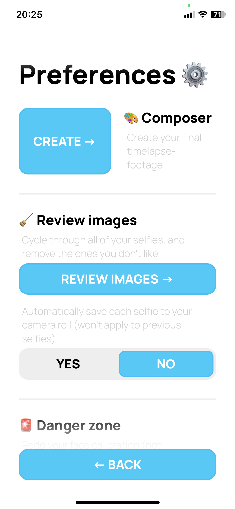

# MeLapse 📸
This repo is a react-native app ([expo](https://expo.dev)), which I've spent the last couple months building. It started in April 2023 and have not been able to work on this project every week.

I restarted the project (which is now this repo) because the I wasn't really proud of my first version. It contained small annoying bugs, and didn't really look all that good. I've now learned from my mistakes since my first try making this app.

### What is this app used for?
This app is used for fun. You take a couple pictures a week of your face and the app auto-aligns every selfie ontop of eachother so that it can be stitched together and look like a smooth timelapse of your face.

### What have I learnt from this app?
I've learnt a lot of things, like file structuring, and project management. But I've also improved at using e.g classes (like the `LSImage` class) for diffrent scenarios to help me keep everything bundled together.

I've also gotten a lot better at TypeScript, and the `expo` / `EAS` ecosystem. I've learnt how to implement notifications, google advertisements, use the native filesystem, googles ML kit's face detection API, and also learnt a bit more of `FFMPEG`.

I also wanted a better way of testing my app - so I did it via apples `TestFlight`. My app was sent to a couple of my friends / family members to try out and give me feedback on things which were unclear / needed improvements.

### Why did I make this app?
Firstly I just wanted to see how my acne changes over time when trying out diffrent medicines, and after building my first prototype in april 2022 I realised that it could potentially be used outside of "acne-tracking". I've previously seen videos on YouTube where people take photos of their face and (I'm pretty sure) manually overlay them ontop of eachother. This app just removes all that annoying stuff.

### What are my plans?
I've really not decided yet wether I'd want to publish this app or not, but this could probably be a good addition to my project portfolio.

## Screenshots 🌄

 |  | 
:-------------------------:|:-------------------------:|:-------------------------:

## Appstore screenshots 🌄

 |  | 
:-------------------------:|:-------------------------:|:-------------------------:
